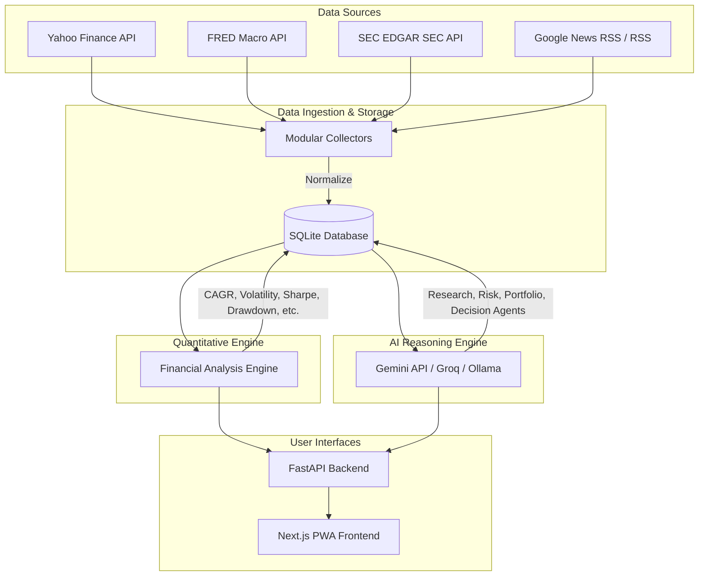

# Aegis AI - Technical Specification & Implementation Plan

Aegis AI is a personal, self-hosted Investment Intelligence Operating System designed to collect financial and macroeconomic data, perform quantitative analysis, run AI-assisted reasoning models, and generate comprehensive monthly investment reports.

This document serves as the Product Requirements Document (PRD), Architecture Specification, and Folder Structure Plan.

## System Architecture



---

## User Review Required

> [!IMPORTANT]
> Since this is a personal application running on local hardware (Intel Core i5, 32GB RAM):
> 1. **Local Running Pattern**: Both the FastAPI backend and Next.js dev server will run locally. The SQLite database will sit as a file in the project directory.
> 2. **AI API Keys**: We need Gemini API keys for the primary LLM reasoning. We should use a `.env` file in the backend to store this safely.
> 3. **FRED API Key**: FRED requires a free API key. We will need to obtain one or fallback to Yahoo Finance / web-scraping if needed.
> 4. **No Authentication**: The application will run entirely locally with no login screen, making it frictionless to use.

---

## Open Questions

> [!WARNING]
> Please review and confirm the following design details:
> 1. **PWA Offline Support**: Since this dashboard needs Internet for fresh data, should the PWA cache the SQLite-served reports offline, or is a standard desktop/mobile-responsive responsive layout sufficient?
> 2. **Ollama Integration**: Do you currently have Ollama installed locally? If yes, what is your preferred default local model (e.g., `llama3`, `mistral`)? If not, we will focus on Gemini/Groq first.
> 3. **FRED API Key availability**: Do you have a FRED API key, or should we use alternative macroeconomic scraping / Yahoo Finance tickers (e.g. `^IRX` for Treasury bills) as a fallback?

---

## Proposed Folder Structure

We will organize the repository into a monorepo format:
- `backend/`: FastAPI backend, collectors, quantitative engine, database, and AI modules.
- `frontend/`: Next.js web application using React, Tailwind CSS, and shadcn/ui.
- `data/`: Local storage for the SQLite database file and raw cached downloads.

```
finance/
├── backend/
│   ├── app/
│   │   ├── api/             # FastAPI endpoints (portfolio, research, reports)
│   │   ├── collectors/      # Independent, modular data collectors
│   │   │   ├── base.py      # Base collector interface
│   │   │   ├── yahoo.py     # Yahoo Finance collector
│   │   │   ├── fred.py      # Macro FRED collector
│   │   │   └── sec.py       # SEC EDGAR collector
│   │   ├── core/            # Configuration, logging, database setup
│   │   ├── database/        # SQLite models, schemas, migrations
│   │   ├── engine/          # Financial quantitative engine (deterministic)
│   │   ├── ai/              # AI Agents (Research, Risk, Portfolio, Decision)
│   │   └── main.py          # FastAPI application entrypoint
│   ├── tests/               # Backend tests
│   ├── .env.example
│   ├── requirements.txt
│   └── run.py               # Utility to start backend
├── frontend/
│   ├── src/
│   │   ├── app/             # Next.js App Router (Dashboard, Portfolio, AI Chat, etc.)
│   │   ├── components/      # UI components (shadcn/ui, charts)
│   │   ├── hooks/           # React hooks for API state
│   │   └── lib/             # Utility functions
│   ├── public/              # Static assets and icons for PWA
│   ├── package.json
│   └── tailwind.config.js
└── data/
    └── aegis.db             # Local SQLite database
```

---

## Proposed Database Schema

We will use SQLite with SQLAlchemy in Python.

### 1. `assets`
Stores securities, crypto, or indices.
- `id`: INTEGER Primary Key
- `ticker`: VARCHAR (unique index)
- `name`: VARCHAR
- `asset_type`: VARCHAR (e.g., 'stock', 'etf', 'crypto', 'index')
- `currency`: VARCHAR

### 2. `historical_prices`
Daily pricing data.
- `id`: INTEGER Primary Key
- `asset_id`: INTEGER Foreign Key -> `assets.id`
- `date`: DATE
- `open`: NUMERIC
- `high`: NUMERIC
- `low`: NUMERIC
- `close`: NUMERIC
- `volume`: INTEGER

### 3. `financial_statements`
Normalized company fundamentals (SEC / Yahoo Finance).
- `id`: INTEGER Primary Key
- `asset_id`: INTEGER Foreign Key -> `assets.id`
- `period`: VARCHAR (e.g., '2025-Q1', '2024-FY')
- `revenue`: NUMERIC
- `net_income`: NUMERIC
- `operating_cash_flow`: NUMERIC
- `free_cash_flow`: NUMERIC
- `total_assets`: NUMERIC
- `total_liabilities`: NUMERIC

### 4. `macro_data`
FRED economic data.
- `id`: INTEGER Primary Key
- `series_id`: VARCHAR (e.g., 'CPIAUCSL', 'UNRATE', 'FEDFUNDS')
- `date`: DATE
- `value`: NUMERIC

### 5. `portfolio_positions`
User positions.
- `id`: INTEGER Primary Key
- `asset_id`: INTEGER Foreign Key -> `assets.id`
- `shares`: NUMERIC
- `average_buy_price`: NUMERIC
- `last_updated`: TIMESTAMP

### 6. `monthly_reports`
AI-generated reports.
- `id`: INTEGER Primary Key
- `date`: DATE (e.g., '2026-07-01')
- `content`: TEXT (Markdown format)
- `status`: VARCHAR (e.g., 'draft', 'finalized')

---

## Proposed Implementation Milestones

### Phase 1: Foundation & Backend Core
- [ ] Initialize Python environment, project structure, config files.
- [ ] Database Schema setup using SQLite and SQLAlchemy.
- [ ] Base Data Collector infrastructure & Yahoo Finance Collector implementation.
- [ ] Quantitative Financial Engine (returns, volatility, Sharpe, beta).

### Phase 2: AI Agents & Macro Integration
- [ ] Google Gemini, Groq, and Ollama integration utility.
- [ ] 4-Agent Framework (Research, Risk, Portfolio, Decision).
- [ ] FRED macro-collector & SEC EDGAR financial collector.
- [ ] Report generation pipeline (monthly reports, SQLite storage).

### Phase 3: Frontend PWA Core
- [ ] Next.js setup (Tailwind CSS, shadcn/ui installation).
- [ ] TradingView Lightweight Charts component integration.
- [ ] Navigation shell (Dashboard, Portfolio, AI Chat, Reports).

### Phase 4: Polish & Integration
- [ ] Connect Frontend pages to backend API.
- [ ] Implement responsive layout (desktop & mobile).
- [ ] Build & package PWA capabilities (manifest, service workers).
- [ ] End-to-end user manual verification.

---

## Verification Plan

### Automated Tests
- Python tests: `pytest` for the Financial Engine formulas (Sharpe, beta, CAGR) and mock data collector.
- API tests: FastAPI endpoint testing.

### Manual Verification
- Launch local FastAPI backend & run collectors.
- Open Next.js dashboard in mobile-responsive preview.
- Trigger AI monthly report generation and verify outputs.
